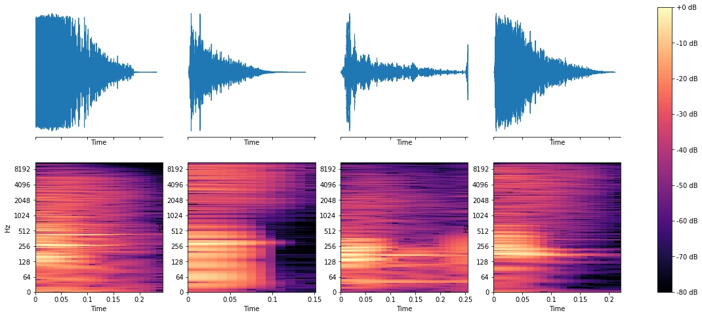

# Drum Sound Classification

A python module for making pandas datasets out of drum libraries, and training drum type classification models using a few different methods. Read my accompanying [blog post](https://soundsandwords.io/drum-sound-classification).

### Set up

1) Install requirements with `pip`. From this cloned repository it should be enough to do `pip install .`, but using a [virtual environment](https://docs.python-guide.org/dev/virtualenvs/) is encouraged.
2) Get drum sounds. I recommend [r/drumkits](https://www.reddit.com/r/Drumkits/)
3) Run something like `python drum_sound_classifier/preprocess.py --drum_lib_path /path/to/drums`. This will recursively search, so nested directories are fine. It will safely skip any non-audio files. Run `python preprocess.py --help` for options.
    - If you would like to inspect the resulting dataset yourself, this will create a pickled pandas dataframe `data/interim/dataset.pkl`

### Training

To train a random forrest classifier on drum descriptors, run:

`python drum_sound_classifier/models/train_sklearn.py --inputs descriptors --model random_forest`

You may want to add `--no_extract_spectrograms` if you don't plan on using a GPU to train a CNN model. Otherwise, spectrogram data will be pre-extracted which takes up disk space.

To train a CNN-based model (a GPU is essential), run:

`python drum_sound_classifier/models/train_cnn.py`

And finally, assuming you have a CNN model trained, to try a SVC over CNN embeddings run:

`python drum_sound_classifier/models/train_sklearn.py --inputs cnn_embeddings --model svc`

Run any of the above with `--help` for options.

### Inference

I have yet to add support for inference using sklearn-derived models (pull requests welcome!), but to infer with CNN models see `inference.py`
